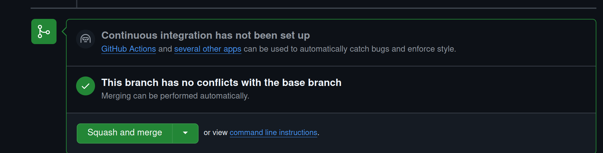
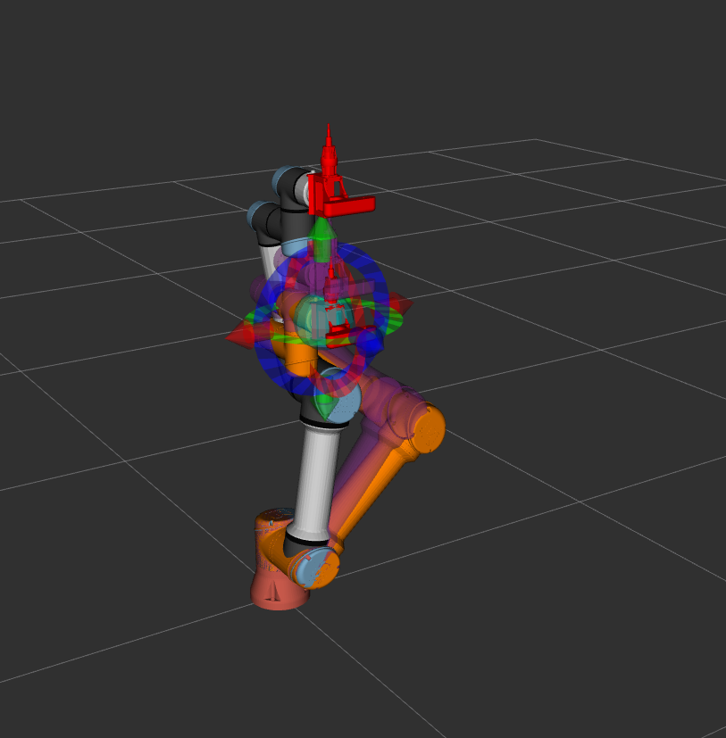
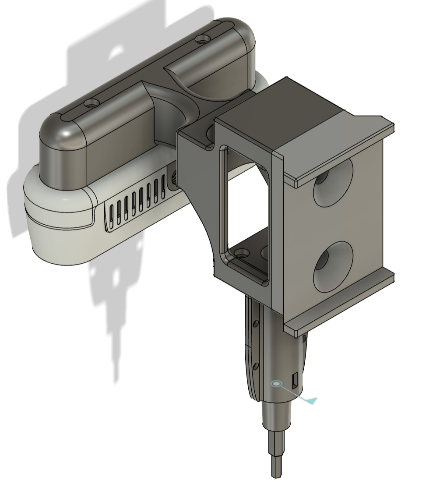
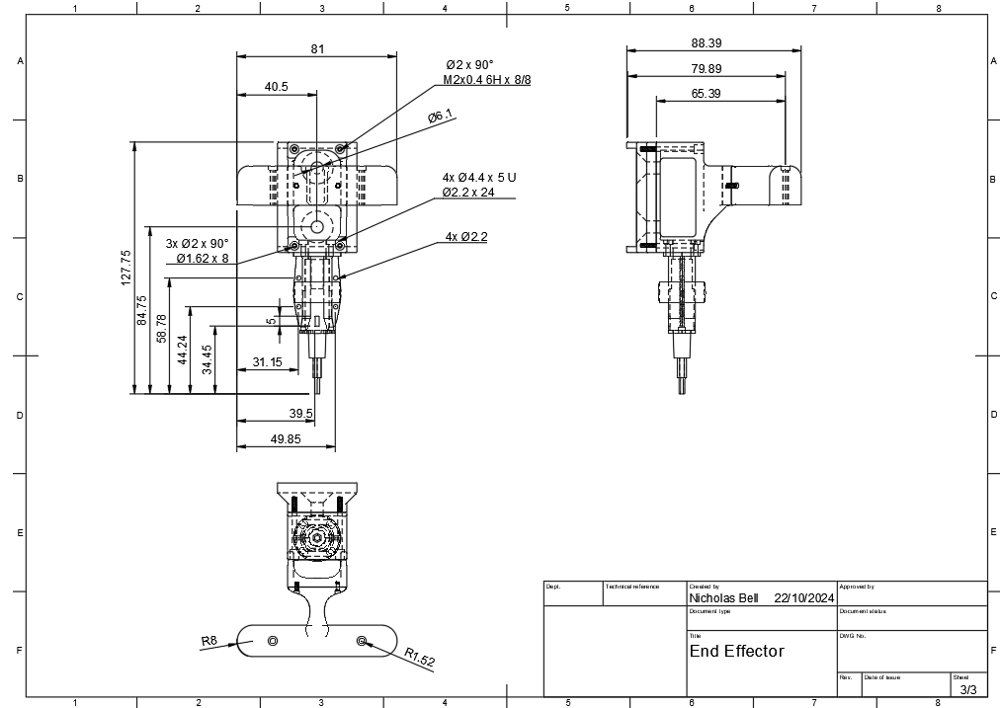
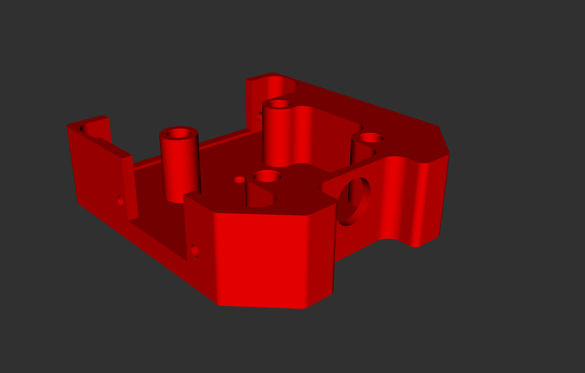
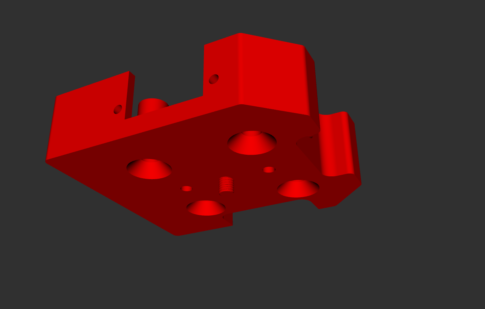
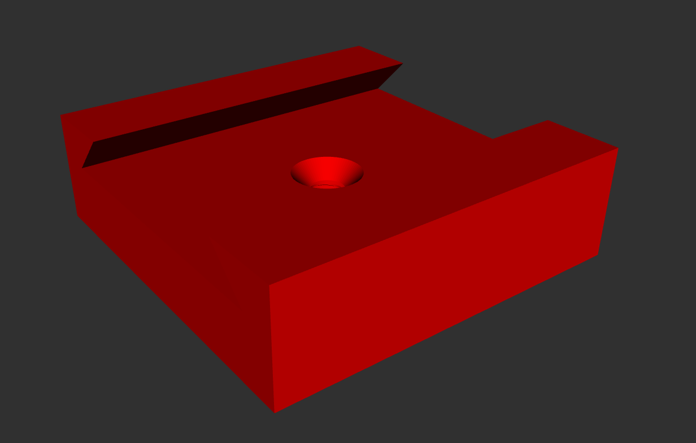
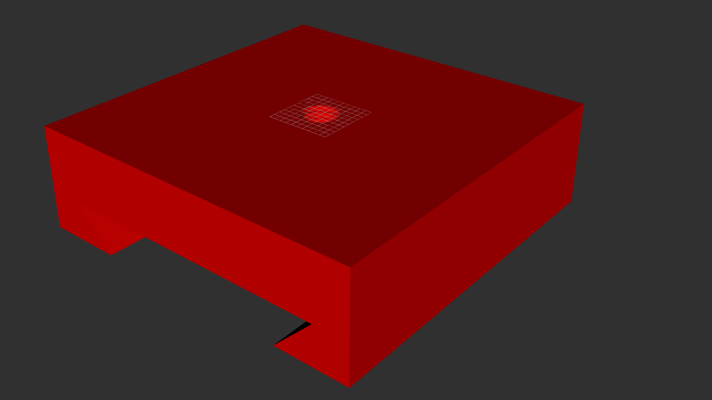

<!-- omit from toc -->
# SCREWDRIVING BOT 1

- [Workspace Structure](#workspace-structure)
  - [ROS Packages](#ros-packages)
  - [Others](#others)
  - [Motion Plan Overview](#motion-plan-overview)
  - [System Flowchart](#system-flowchart)
- [Feature Overview](#feature-overview)
  - [Hole Detection](#hole-detection)
    - [To test on a video](#to-test-on-a-video)
    - [To test on an image](#to-test-on-an-image)
  - [To run tests with end-effector connected](#to-run-tests-with-end-effector-connected)
  - [To run tests without end-effector connected](#to-run-tests-without-end-effector-connected)
  - [End-effector visualisation](#end-effector-visualisation)
  - [Custom End-effector](#custom-end-effector)
  - [Housing block](#housing-block)
  - [Screw block](#screw-block)

### Bugs to fix
- ~~brain_routine_test sometimes send two commands to brain~~  
  - ~~need to add `is_busy` support in brain~~
### Recent Updates
- [Week 9 Tue][David] Move to screw fully working, change home position, change in arm-movement pkg, ignore large screws
- [Week 9 Mon][David] Add `OOI` frame that indicates the screwhole, add transformation to real-coordinate support
- [Week 8 Wed][David] Add support for converting to RealCoor with respect to base_link, bring back transformation pkg
- [Week 8 Wed][David] Fix centroid locating algo
- [Week 8 Tue][David] enable collosion check, add toolpoint_link and camera_link, deprecated transformation pkg
- [Week 7 Sun][David] add dy_trans between camera_socket and camera, tune end_effector scale
- [Week 7 Sun][David] end_effector_description package complete, system_launch now launches with UR5e and camera and end_effector visualisation
- [Week 7 Sat][David] Add stub for Screwdriving Routine
- [Week 7 Wed][David] Vision and Brain framework completed; testing package added

### Push to main branch: CREATE PULL REQUEST!!!
- rebase first (so that the latest commits are on top) 
  - `git fetch origin            # Updates origin/master`\
    `git rebase origin/master    # Rebases current branch onto origin master`
- Make sure you squash the commits when merging
- 
- Make sure the codebase is stable
- Add to "Recent Updates" if it's a feature update 

## Workspace Structure
### ROS Packages
- **movement**  
  (services and publisher model for communicating with the UR5e)  
  - arm_brain
  - arm_movement
  - `README.md` (for movement)
- **vision**  
  (Centroid locating services and publisher model)  
  - Vision Server
- **end_effector**  
  (end_effector related publisher and control algo)
  - end_effector (Server offering services such as screwdriving, light on/off, status report)
  - arduino_serial (For bridging Arduino and ROS2)
- **end_effector_description**
  (contains end_effector visualisation, camera launch, and UR5e launch)
- **brain**
- - brain
- **interfaces**  
  (Custom messages and services)
  - Src
	- BrainCmd (for testing individual packages)
	- VisionCmd (interface with Vision Module)
	- EndEffectorCmd 
	- ArmCmd (interface with Moveit and UR5e)
	- BrainRoutineCmd (run the closed-loop operation)
	- PublishOoiCmd (publish a frame `OOI` that indicates the target screwhole)
	- RealCoorCmd (converting to coordinate with respect to `base_link`)
  - Msg
	- N/A
- **transformations**
  (Static Transformations publishers)
  ~~- camera_dy_trans (dy_broadcaster bewteen camera_socket and camera)~~
  - ooi_server (publish `OOI`, convert to RealCoor with respect to base_link)
### Others
- end_effector visualisation in Rviz

### Motion Plan Overview

### System Flowchart

## Feature Overview

### Hole Detection
The code is tuned for small circles

#### To test on a video
`python3 blob_detection.py`
#### To test on an image
`python3 blob_detection_im.py`

### To run tests with end-effector connected
**Step 1**: In one terminal, run `ros2 launch brain system_launch.py`
**Step 2**: In another terminal, run `ros2 run testing brain_vision_test`, or other testing files

### To run tests without end-effector connected
**Step 1**: In one terminal, run `ros2 launch brain without_endeffector_launch.py`
**Step 2**: In another terminal, run `ros2 run testing brain_vision_test`, or other testing files

### End-effector visualisation
1. `use_fake` indicates whether Real or Fake UR5e is used
2. There are launch files that launches only the end-effector or the end-effector with UR5e with no driver support
   1. `ros2 launch end_effector_description end_effector_only.launch.py`
   2. `ros2 launch end_effector_description end_effector_withModel.launch.py`

### Custom End-effector

  

### Housing block

  

  

### Screw block

  

  

