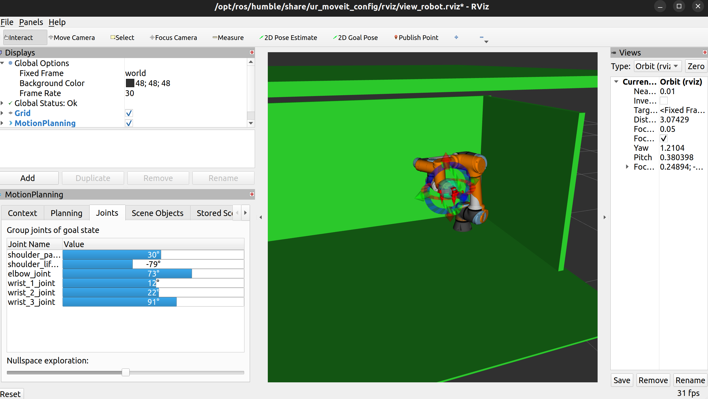

# I like to moveit moveit

This is a utility function which enables movement of the ur5e robot arm using moveit.
It has been hyper tuned to this specific use case by constraining specific joint movement angles.

## Important Note
Upon launching RViz2, you **MUST** plan and execute an initial movement to set the joints as follows:
- All joints should be > 0, **except** `shoulder_lift_joint`, which should be < 0.
Refer to the image below for guidance.

## Commands to Run
To run the node use the command:
```
    ros2 launch brain without_movement_launch.py       
    ros2 launch movement arm_launch.py                 
```
Alternatively:
```
    ros2 launch brain system_launch.py
```

## Testing Movement Commands
Followed by specific srv calls to test (make sure terminal is sourced):
```
    ros2 service call /arm_srv interfaces/srv/ArmCmd "{mode: 'hole', point: {x: 0.3, y: 0.6, z: 0.65}}"
    ros2 service call /arm_srv interfaces/srv/ArmCmd "{mode: 'home', point: {x: 0.0, y: 0.0, z: 0.0}}"
```

### Set joint angles before going to home to ensure planning success




## TODO: 
- Create line constraint for the hole/tool commands so that they move linearly along a line path/plane and not in an arc.

=======


To launch the nodes, use the following commands:

```bash
# Launches the system without movement functionalities
ros2 launch brain without_movement_launch.py       

# Launch
